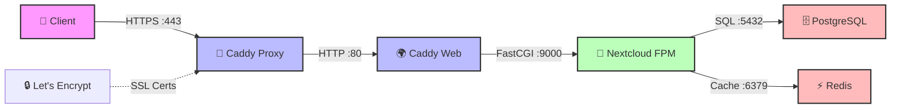
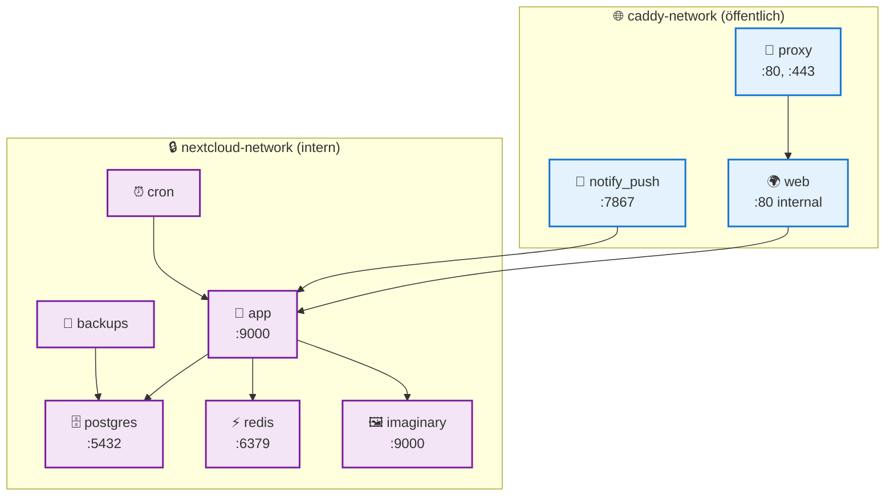
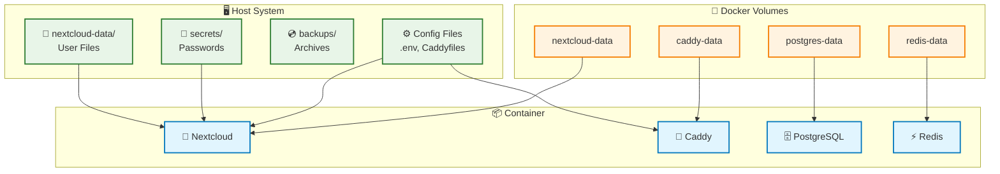
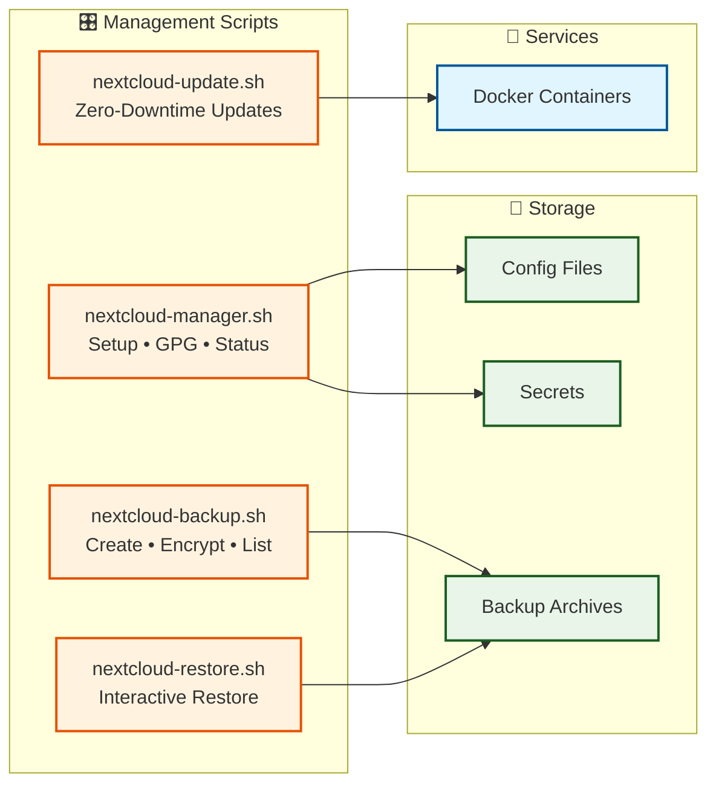

# Nextcloud Docker Compose Setup

Dieses Repository enthält zwei verschiedene Nextcloud Docker Compose Setups:

- **Traefik-Version** (Original): `nextcloud-traefik-docker-compose.yml`
- **Caddy-Version** (Neu): `nextcloud-caddy-docker-compose.yml` - **Empfohlen!**

## 🚀 Caddy-Setup (Empfohlen)

Das neue Caddy-Setup bietet erweiterte Features und eine bessere Wartbarkeit. Siehe [README-Caddy.md](README-Caddy.md) für Details.

### Schnellstart Caddy:
```bash
./nextcloud-manager.sh setup
```

## 📊 System-Architektur

### 🌐 Hauptkommunikationsfluss (Request-Response)



### 🐳 Container-Services & Netzwerke



### 💾 Datenpersistierung & Volumes



### 🛠️ Management & Scripts



## 📋 Komponenten-Übersicht

### 🐳 Container Services:
- **proxy**: Caddy Reverse Proxy (HTTPS, Let's Encrypt)
- **web**: Caddy Webserver (FastCGI zu PHP-FPM)
- **app**: Nextcloud FPM Application
- **postgres**: PostgreSQL Datenbank
- **redis**: Cache und Session Storage
- **cron**: Nextcloud Background Jobs
- **notify_push**: Real-time Push Service
- **imaginary**: Preview Generator
- **backups**: Automated Backup Service

### 🛠️ Management Scripts:
- **nextcloud-manager.sh**: Setup, GPG, Secrets, Status
- **nextcloud-backup.sh**: Backup-Management mit GPG-Verschlüsselung
- **nextcloud-restore.sh**: Interaktive Wiederherstellung
- **nextcloud-update.sh**: Zero-Downtime Updates

### 🔐 Sicherheitsfeatures:
- Docker Secrets für Passwörter
- GPG-Verschlüsselung für Backups
- Network Segmentierung
- Automatische SSL-Zertifikate

## 🔧 Legacy Traefik-Setup

Das ursprüngliche Traefik-Setup ist weiterhin verfügbar:

```bash
docker-compose -f nextcloud-traefik-docker-compose.yml up -d
```

**Hinweis**: Das Caddy-Setup wird für neue Installationen empfohlen, da es erweiterte Features und bessere Wartbarkeit bietet.
